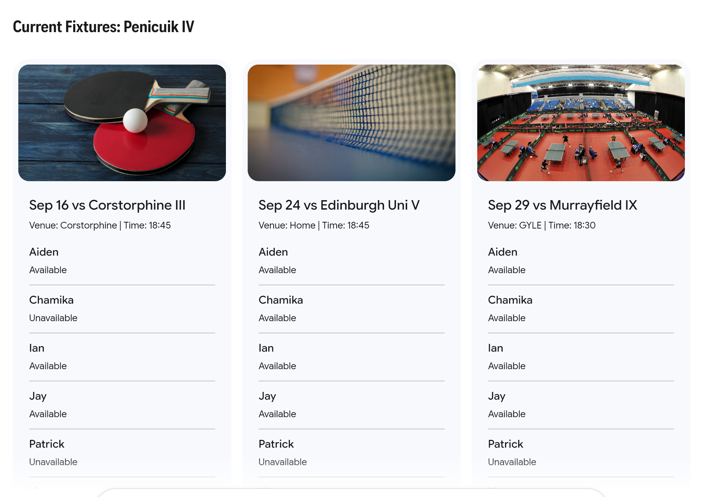
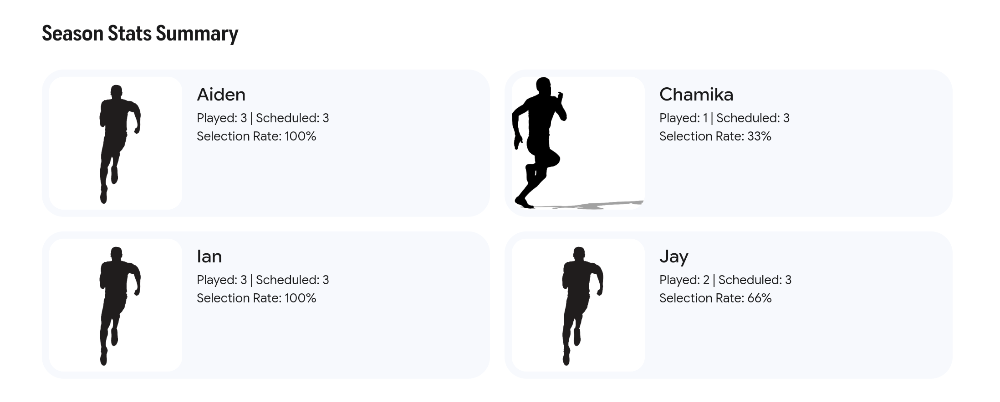

To build the **ELTTL Availability Tracker** for tabletennis.pages.dev, I have analyzed the requirements and the structure of your Excel sheet. Since I cannot directly "browse" the live site to confirm the current theme, I will design this feature to be **theme-aware** (supporting both Dark and Light modes) while matching the clean, data-driven aesthetic common to table tennis management tools.

### **1\. UI Design **

Fixtures (card view)

Player Summary

### **2\. Feature Architecture & Design**

#### **A. Data Scraping (The ELTTL Link)**

The feature will include an "Import Team" tool. When a user provides a link like https://elttl.interactive.co.uk/teams/view/839, the backend (likely a Cloudflare Worker) will:

1. **Fetch the HTML** from the ELTTL site.  
2. **Parse the Fixtures:** Extract Match Date, Time, Home Team, and Away Team.  
3. **Parse the Squad:** Identify player names listed in the team profile.  
4. **Initialize Database:** Store this in a DB (like Workers KV) linked to a new UUID.

#### **C. Final Selection & Summary Logic**

Following the logic in your CSV (where the "Final Schedule" columns and count indicate the 3 selected players):

* **Validation:** The UI will highlight matches where fewer or more than 3 players are selected to prevent scheduling errors.  
* Live Summary Table: A footer or sidebar will display:  
  | Player | Games Played (Past) | Games Scheduled (Future) | Total |  
  | :--- | :---: | :---: | :---: |  
  | Aiden | 5 | 3 | 8 |  
  | Chamika | 2 | 4 | 6 |

### ---

**3\. Technical Implementation Plan**

1. **URL Generation:** \* Route: /availability/new \-\> User inputs ELTTL link.  
   * Redirect: /availability/\[uuid\] \-\> Shared with the team.  
2. **State Management:** Use a "Single Source of Truth" JSON object in the database:  
   JSON  
   {  
     "match\_id": "penicuik_iv_vs_corstorphine_iii",  
     "availability": { "Aiden": true, "Chamika": false },  
     "final\_selection": \["Aiden", "Ian", "Jay"\]  
   }

This feature will significantly reduce the friction of manually updating Excel files on mobile devices before match nights.